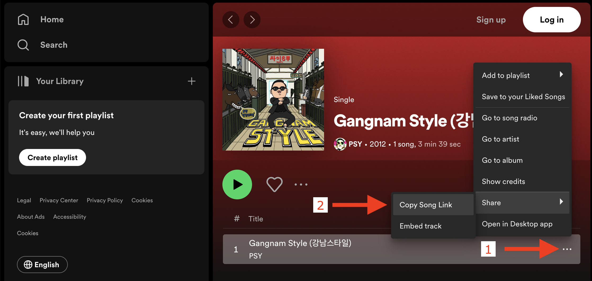

# Spotify Audio Analysis Client
Illustrates how to use [Spotify's audio analysis web API](https://developer.spotify.com/documentation/web-api/reference/get-audio-analysis) to fetch the audio analysis for a Spotify track.

## Setup
1. Run `npm install` to install the tool's dependencies.
2. Create the configuration file for authenticating with Spotify:
    1. Get a "client ID" and a "client secret" by following [Spotify's "Create an app"](https://developer.spotify.com/documentation/web-api/tutorials/getting-started#create-an-app) instructions.
    2. Create a file called [`./creds/spotify.js`](./creds/spotify.js) and populate it with your "client ID" and "client secret". The file should be formatted like this:
        ```
        export const clientId = 'YOUR_ID_HERE';
        export const clientSecret = 'YOUR_SECRET_HERE';
        ```

## Usage
`node main.js <spotify-track-id> <spotify-analysis-output.json>`

For example, the Spotify track ID for Gangnam Style is `03UrZgTINDqvnUMbbIMhql` so you can fetch Spotify's audio analysis for it and store it in `gangnamStyleAnalysis.json` with this command:

`node main.js 03UrZgTINDqvnUMbbIMhql gangnamStyleAnalysis.json`

## Looking up a Spotify track ID
1. Find the song of interest in the [Spotify web app](https://open.spotify.com/).
2. Click the "..." to the right of the song title. ((1) in the screenshot)
3. In the context menu that appears:
    1. Choose "Share"
    2. Choose "Copy Song Link" ((2) in the screenshot)
4. The track's URL should now be on your clipboard. For example, for Gangnam Style my clipboard contained `https://open.spotify.com/track/03UrZgTINDqvnUMbbIMhql?si=e148916771984610`
5. The last path component of the URL is the track's ID. For example, for Gangnam Style it is `03UrZgTINDqvnUMbbIMhql`.

Here's a screenshot illustrating the steps within the Spotify web app:

